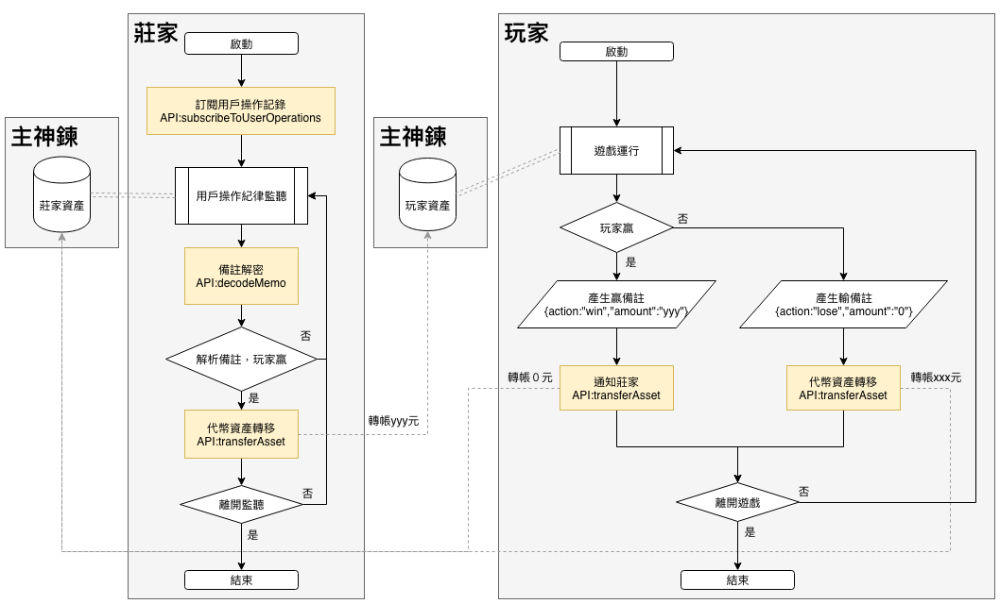
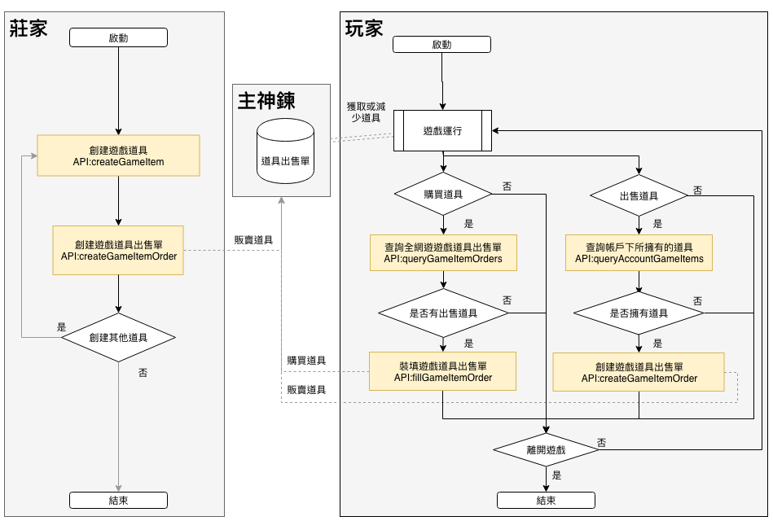

# 開發Android區塊鏈遊戲

## 簡介


> #### 本範例是透過二十一點遊戲，說明如何透過主神鍊SDK，開發區塊鏈遊戲。  
> #### 二十一點英文名字叫Black Jack，是賭場常見的玩法。玩家目的就是要取得最接近二十一點的點數，而又不能超過二十一點（爆掉），然後和莊家比大小。
> #### 範例內容包含註冊一個玩家及一個莊家（遊戲開發者），以Motion發行的MTN幣做為下注籌碼。此外，莊家可以創建及販賣道具供玩家購買來為撲克牌換花色。

## 主神鏈 SDK 初始化

> 欲透過主神鍊SDK開發區塊鏈遊戲，必需先初始化主神鏈SDK

```java
BclSDK bclSDK = new BclSDK();
bclSDK.init(Context, "zeus_url", "zeus_name", "zeus_core_asset", "zeus_faucetUrl", "zeus_chainId",
            new IBclCallBack() {
                @Override
                public void onReceiveValue(String s) {
                	try {
                    	JSONObject jsonObject = new JSONObject(s);
                    	int status = jsonObject.getInt("status");
                    	switch (status) {
                        	case 1:
                            	//初始化成功
                            
                            	break;
                        	default:
                            	//初始化失敗

                            	break;
                    	}
                	} catch (JSONException e) {
                    	e.printStackTrace();
                	}
                }
            },
            new RpcConnectionStatusCallBack() {
                @Override
                public void callBack(String s) {
                    try {
                    	JSONObject jsonObject = new JSONObject(s);
                    	String status = jsonObject.getInt("status");
                        switch (status) {
                            case "realopen":

                                break;

                            case "error":

                                break;

                            case "closed":

                                break;
                        }
                }
            });
    }
```


## 二十一點遊戲中的角色定義

只要透過主神鏈SDK [註冊帳號接口](idl.md#注册账号)，註冊帳號後即可成為玩家，有了玩家帳號再透過[註冊遊戲開發者接口](idl.md#注册游戏开发者)即可申請成為遊戲開發者。二十一點遊戲中的莊家角色必需是遊戲開發者。  

* 莊家（遊戲開發者） - 可以創建遊戲版本內的道具

* 玩家

注意事項：無申請遊戲開者皆為普通玩家帳號

```java
/* 註冊帳號 */
bclSDK.signup(username, pwd, new IBclCallBack() {
            @Override
            public void onReceiveValue(String s) {
                try {
                    JSONObject jsonObject = new JSONObject(s);
                    int status = jsonObject.getInt("status");
                    switch (status) {
                        case 1:
                            //註冊成功
                            
                            break;
                        default:
                            //註冊失敗

                            break;
                    }
                } catch (JSONException e) {
                    e.printStackTrace();
                }
            }
        });
```


```java
/* 註冊遊戲開發者
呼叫此接口，需先登入
*/
bclSDK.registerGameDeveloper(new IBclCallBack() {
            @Override
            public void onReceiveValue(String s) {
                try {
                    JSONObject jsonObject = new JSONObject(s);
                    int status = jsonObject.getInt("status");
                    switch (status) {
                        case 1:
                            //註冊成功
                            
                            break;
                        default:
                            //註冊失敗

                            break;
                    }
                } catch (JSONException e) {
                    e.printStackTrace();
                }
            }
        });
```


## 二十一點遊戲中的輸嬴帳務處理

二十一點遊戲是以Motion發行的MTN幣做為籌碼，透過主神鏈SDK [轉帳接口](idl.html#转账)、 [DecodeMemo接口](idl.html#DecodeMemo)及[订阅用户操作记录变更接口](idl.html#订阅用户操作记录变更)來處理莊家及玩家間輸嬴的帳務處理。說明如下：

玩家輸：直接將金額透過 [轉帳接口](idl.html#转账)轉給莊家。  
玩家嬴：透過 [轉帳接口](idl.html#转账)通知莊家，轉帳金額為0。  
莊家透過[订阅用户操作记录变更接口](idl.html#订阅用户操作记录变更)監聽來自玩家的轉帳訊息，接收到轉帳訊息後，透過[DecodeMemo接口](idl.html#DecodeMemo)解碼，將金額轉給贏家。

為逹到以上處理流程，必需設計兩支App來處理，一支即遊戲本身，另一支App需登入莊家帳號並監聽來自玩家的轉帳訊息（需透過模擬器或另一支手機來執行，實務上，可以設計由後端API來替代此App角色）。



```java
/* 查询用户指定代币资产
呼叫此接口，需先登入
*/
        bclSDK.queryAccountAllBalances(account, unit, new IBclCallBack() {
            @Override
            public void onReceiveValue(String s) {
                try {
                    JSONObject jsonObject = new JSONObject(s);
                    int status = jsonObject.getInt("status");
                    switch (status) {
                        case 1:
                            //成功
                            JSONArray jsonArray = jsonObject.getJSONArray("data");
                            for (int i = 0; i < jsonArray.length(); i++) {
                                JSONObject jsonObject1 = jsonArray.getJSONObject(i);
                                if (jsonObject1.get("id").equals("1.3.0"))
                                    Log.i(TAG, "Balance:" + jsonObject1.get("balance"));
                            }
                            break;
                        default:
                            //失敗

                            break;
                    }
                } catch (JSONException e) {
                    e.printStackTrace();
                }
            }
        });
```


```java
/* 轉帳
呼叫此接口，需先登入
*/
boolean winner = true;
String bet = "10";
JSONObject obj = new JSONObject();
try {
     obj.put("action", winner ? "win" : "lose");
     obj.put("amount", winner ? bet : "0");
     Log.i(TAG, "JSON:" + obj.toString());
} catch (JSONException e) {
     e.printStackTrace();
}


        bclSDK.transferAsset("toAccount", "1.3.0", winner ? "0" : bet, obj.toString(), false, new IBclCallBack() {
            @Override
            public void onReceiveValue(String s) {
                try {
                    JSONObject jsonObject = new JSONObject(s);
                    int status = jsonObject.getInt("status");
                    switch (status) {
                        case 1:
                            //成功
                            
                            break;
                        default:
                            //失敗

                            break;
                    }
                } catch (JSONException e) {
                    e.printStackTrace();
                }
            }
        });
```

```java
/* DecodeMemo
呼叫此接口，需先登入
*/
private void decodeMemo(final String transferTo, String memo) {
    bclSDK.decodeMemo(memo, new IBclCallBack() {
            @Override
            public void onReceiveValue(String s) {
                try {
                    JSONObject jsonObject = new JSONObject(s);
                    int status = jsonObject.getInt("status");
                    switch (status) {
                        case 1:
                            //成功
                           	if (!transferTo.isEmpty() && !transferTo.equals("莊家帳號")) {
                               JSONObject jsonObjectData = jsonObject.getJSONObject("data");
                               JSONObject jsonObjectText = new JSONObject(jsonObjectData.getString("text"));
                              switch (jsonObjectText.getString("action")) {
                                   case "signup":
                            transferAsset(transferTo, "1.3.0", "10.0", jsonObjectData.getString("text"), false);
                                        break;

                                   case "lose":

                                        break;

                                   case "win":
                                        transferAsset(transferTo, "1.3.0", jsonObjectText.getString("amount"), jsonObjectData.getString("text"), false);
                                        break;
                           }
                      } 
                            
                            break;
                        default:
                            //失敗

                            break;
                    }
                } catch (JSONException e) {
                    e.printStackTrace();
                }
            }
        });
}
```

```java
/* 订阅用户操作记录变更
呼叫此接口，需先登入
*/
bclSDK.subscribeToUserOperations(account, new IBclCallBack() {
            @Override
            public void onReceiveValue(String s) {
                try {
                    JSONObject jsonObject = new JSONObject(s);
                    int status = jsonObject.getInt("status");
                    switch (status) {
                        case 1:
                            //成功
                            JSONObject jsonObjectData = jsonObject.getJSONObject("data");
                            JSONObject jsonObjectOperation = jsonObjectData.getJSONObject("operation");
                            String type = jsonObjectOperation.getString("type");
                            if(type.equals("transfer")) {
                                //transfer表示為轉帳記錄
                                JSONObject jsonObjectParseOperations = jsonObjectOperation.getJSONObject("parseOperations");
                                //transferTo本記錄由哪個帳號傳來
                                String transferTo = jsonObjectParseOperations.getString("from");
                                JSONObject jsonObjectPayload = jsonObjectOperation.getJSONObject("payload");
                                JSONObject jsonObjectMemo = jsonObjectPayload.getJSONObject("memo");
                                JSONObject obj = new JSONObject();
                                try {
                                    obj.put("from", jsonObjectMemo.getString("from"));
                                    obj.put("to", jsonObjectMemo.getString("to"));
                                    obj.put("nonce", jsonObjectMemo.getString("nonce"));
                                    obj.put("message", jsonObjectMemo.getString("message"));
                                    Log.i(TAG, "JSON:" + obj.toString());
                                    Log.i(TAG, "transferTo:" + transferTo);
                                    decodeMemo(transferTo, obj.toString());
                                } catch (JSONException e) {
                                    e.printStackTrace();
                                }
                            }                            
                            break;
                        default:
                            //失敗
                            break;
                    }
                } catch (JSONException e) {
                    e.printStackTrace();
                }
            }
        });
```


## 如何商城販賣道具

商城指的是此遊戲內概念
> * 登入開發者帳號
> * 創建遊戲版本
> * 創建遊戲道具
> * 創建遊戲道具出售單


注意事項：如有多人要創建遊戲道具需提議關聯遊戲版本
需要該遊戲版本創建者批准。



<br></br>

```objectivec
test
```
<br></br>
<br></br>

## 如何關聯遊戲版本
> * 登入創建遊戲版本開發者帳號
> * 提議關聯遊戲版本
> * 獲取帳戶所收到的提議
> * 批准關聯遊戲


```objectivec
test

```
<br></br>
<br></br>


## 如何刪除、更新、取消、轉移遊戲道具
> * 登入玩家、開發者帳號  

```objectivec
test
class ....

```


注意事項：玩家只能使用轉移及取消 即是商城內買賣道具、取消出售  

```objectivec
登入開發者
class ....

```
<br></br>
<br></br>

## 如何查詢玩家、開發者、遊戲內販賣道具
> * 登入開發者帳號
> * 查詢帳戶下的遊戲道具售賣單
> * 查詢全網遊戲道具售賣單

注意事項：玩家無法查詢，只能在商城中看到自己所販賣道具


